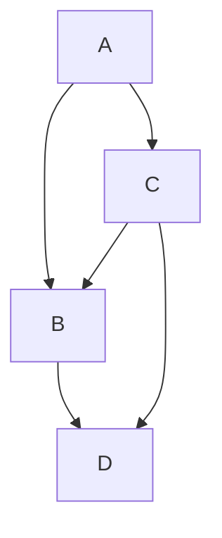
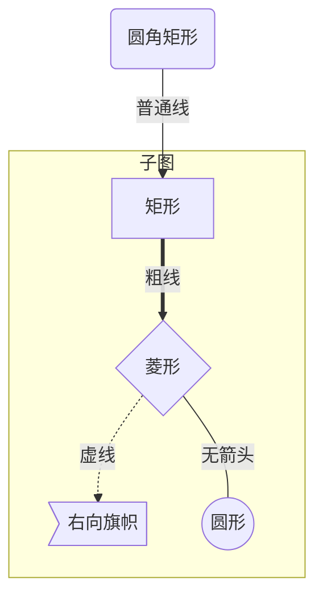
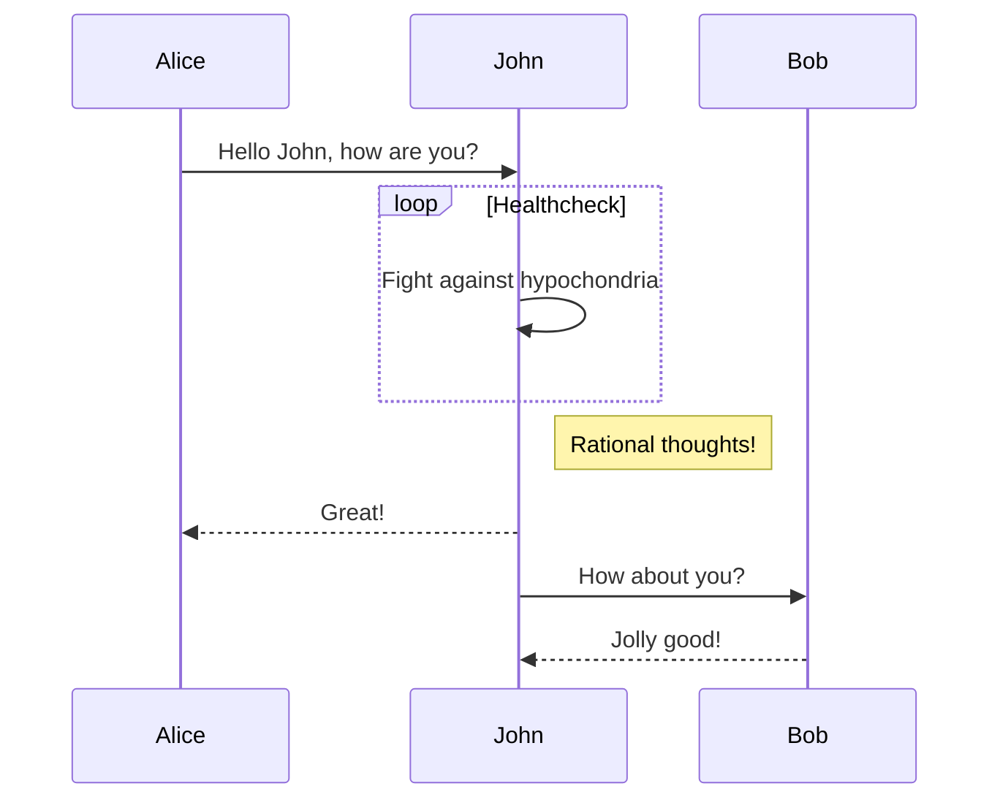
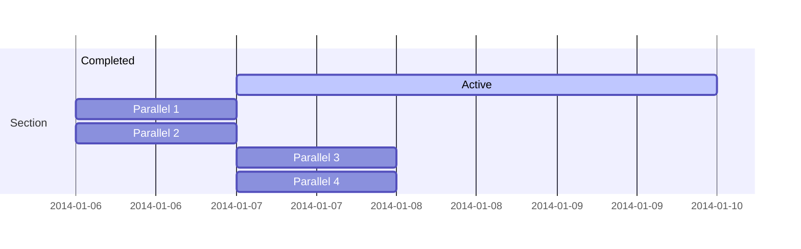
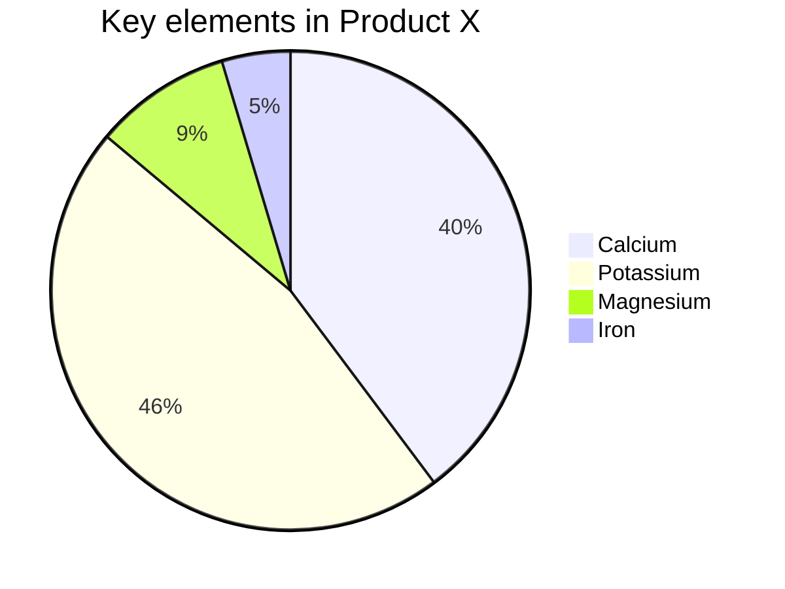
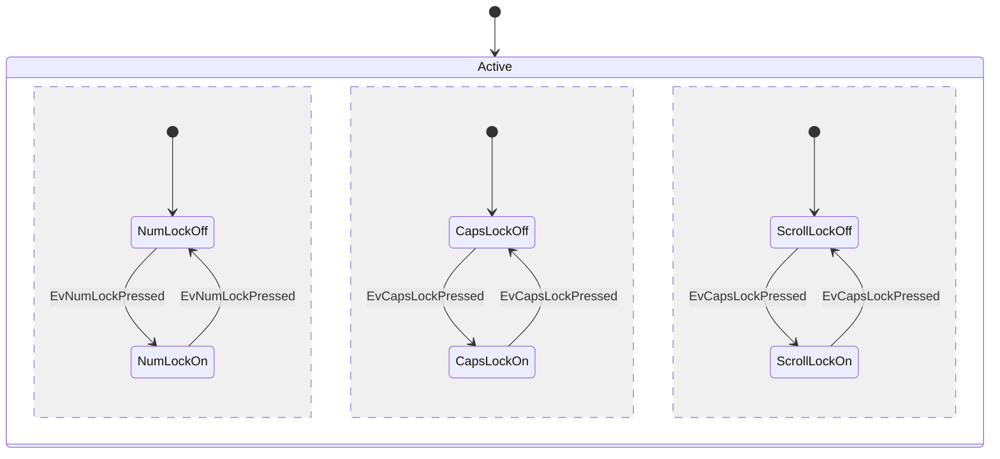
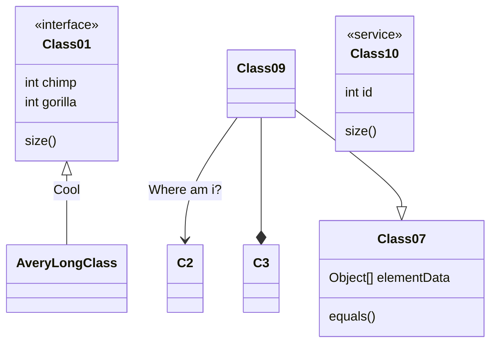
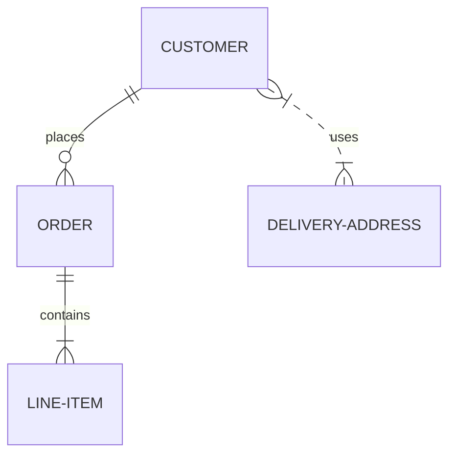

# MARKEDOWN

轻量级标记语言

---
TIP；Ctrl+。可以切换中英标点符号

## 一、多级标题
依次缩进,共六级
># 一级标题
>## 二级标题
>### 三级标题

## 二、字体
### 斜体or粗体
>*斜体* 
__粗体__ 
***粗斜体***

快捷键 **加粗Ctrl+B** *斜体Ctrl+I*
###
## 三、换行
直接在一句话后敲两个空格   
两句话之间加一个空行

如果你在编辑的时候，想让一行文字在显示的时候换行<br/>，就在中间加***br/***.

## 四、引用
>引用
>>嵌套引用
>>>呃呃

## 五、链接
[链接名称](链接地址)
<链接地址>

>[好东西](https://www.roxylib.com/)
or
><https://www.roxylib.com/>

## 六、图片
>


最好在一个文件夹里

![][ / 图片名.图片格式]转化为代码：
* part one
+ part two
  - inside part 
    + TAB向右缩进
>代码：
1. 部分A
2. 部分B
   1.  内部内容TAB

## 八、杂项
### 分割线
---
写分割线前，要空一行之后写，否则会导致前一行字体放大

---
***
- - -
* * *

### 删除线
---
~~这是要被删除的文字~~

### 下划线
---
<u>这行文字已被添加下划线</u>

### 代码块
---
如果在一行内需要引用代码，只需要用反引号`引起来就好了。

`Hello` World.

---
如果是在一个块内需要引用代码，则在需要引用的代码块的前一行和后一行使用三个反引号，同时在前一个反引号后写入代码的语言。
>支持以下语言bash,c，clojure，cpp，cs，css,dart,dockerfile, diff,erlang,go，gradle，groovy,haskell,java，javascript，json，julia,kotlin,lisp，lua,makefile，markdown，matlab,objectivec,perl，php，python,r，ruby，rust,scala，shell，sql，swift,tex，typescript,verilog，vhdl,xml,yaml

```c
#include<stdio.h>
int main (void)
{
    printf("fuck you");
    return 0;
}
```

### 脚注
---
- 使用 Markdown[^1]可以效率的书写文档, 直接转换成 HTML[^2], 你可以使用 Typora[^T] 编辑器进行书写。
  - [^1]:Markdown是一种纯文本标记语言
  - [^2]:HyperText Markup Language 超文本标记语言
  - [^T]:NEW WAY TO READ & WRITE MARKDOWN.


### 特殊符号
---
对于Markdown中的语法符号，前面家反斜线\即可以显示符号本身
>\\  
>\*  
>\_  
>\+  
>\.  
### 表格
---
- 表格使用|来分割不同的单元格，使用-来分隔表头和其他行
  - :-  将表头及单元格内容左对齐
  - -:  将表头及单元格内容右对齐
  - :-: 将表头及单元格内容居中

| 项目   |   价格 | 数量  |
| :----- | -----: | :---: |
| 计算机 | \$1600 |   5   |
| 手机   |   \$12 |  12   |
| 管线   |    \$1 |  234  |

##  九、高级用法

### 支持HTML元素
使用 <kbd>Ctrl</kbd>+<kbd>Alt</kbd>+<kbd>Del</kbd> 摸鱼

### 代办事项
我们可以使用Markdown来制作一个待办事项，格式为、-[] 表示未完成；-[x]表示已完成
- [x] 摸鱼
- [ ] 摸鱼鱼

### 书写公式
可以使用 2个美元符 $ 包裹 TeX 或 LaTeX 格式的数学公式来实现。
/$$表示整行公式  
$$E=mc^2$$

上标使用符号 ^ 包围、下标使用符号 ~ 包围。编辑器不支持时，可分别使用 HTML 标签 6<sup>（superscript）和 6<sub>（subscript）替代。

### 绘制图
#### 流程图


---


---
#### 时序图


---
#### 甘特图


---
#### 饼图


---
#### 状态图


---
#### 类别图


---
#### 实体关系图


---